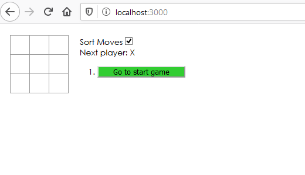

## Tic Tac Toe
The current version of the project was created 
according to the tutorial presented on the 
[official website of the react](https://ru.reactjs.org/tutorial/tutorial.html) with additional tasks:
- [x] Display the location for each move in the format (col, row) in the move history list.
- [x] Bold the currently selected item in the move list.
- [x] Rewrite Board to use two loops to make the squares instead of hardcoding them.
- [x] Add a toggle button that lets you sort the moves in either ascending or descending order.
- [x] When someone wins, highlight the three squares that caused the win.
- [x] When no one wins, display a message about the result being a draw.

 
